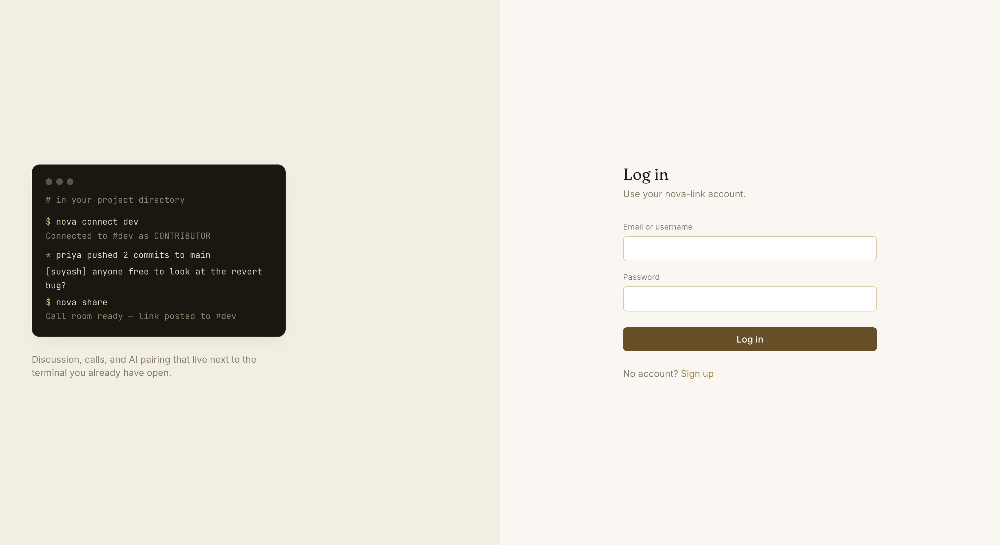
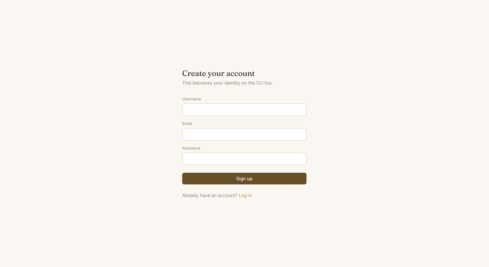
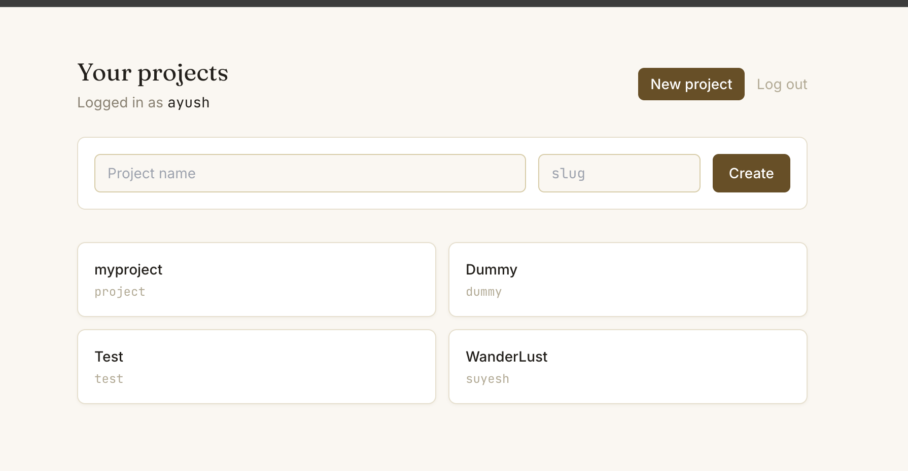
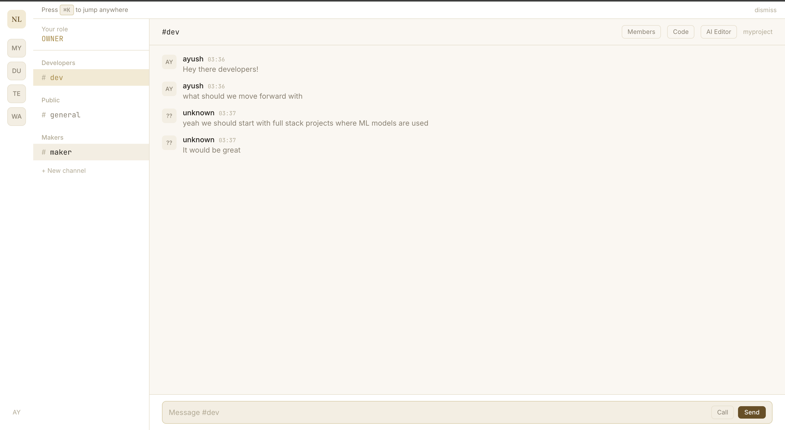
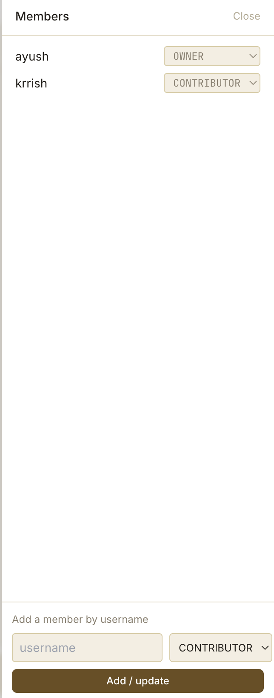
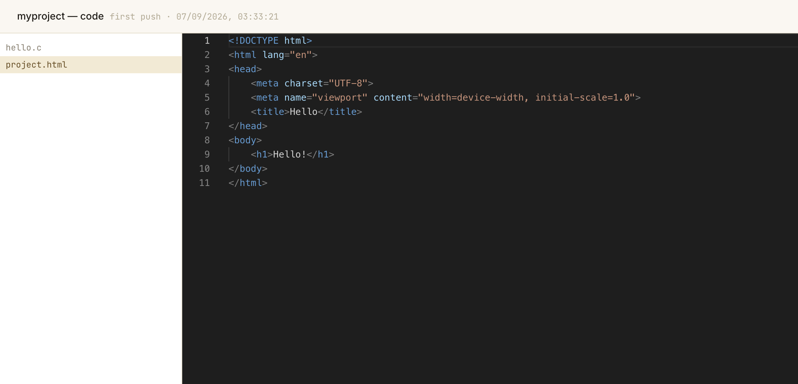
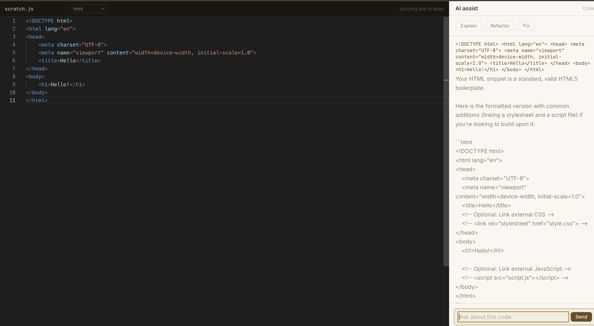
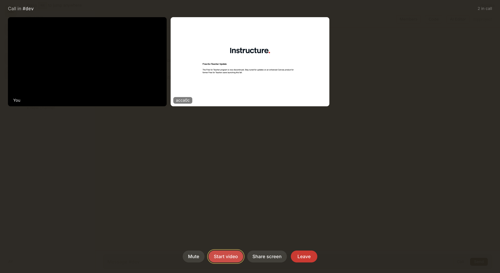
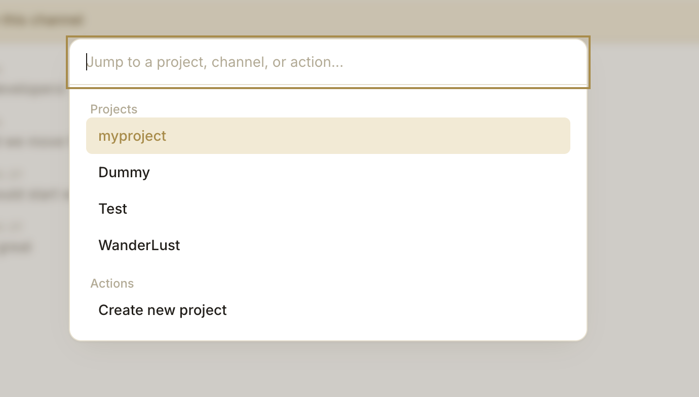

# nova-link

A real-time project discussion platform wired into the terminal — role-based
chat, video calls with screen share, an AI-assisted collaborative code
editor, a browsable/editable code viewer, and a standalone CLI that handles
identity, code push/pull, and pull requests, backed by S3.

Built as a companion to [NovaForge](#) (a custom VCS on the MERN stack),
borrowing its Yargs-based CLI approach for a familiar terminal experience.

---

## Screenshots

<table>
<tr>
<td width="50%">

**Sign up / log in — same identity as the CLI**


</td>
<td width="50%">



</td>
</tr>
<tr>
<td width="50%">

**Your projects**


</td>
<td width="50%">

**Role-gated chat channels — public, developer, and maker rooms**


</td>
</tr>
<tr>
<td width="50%">

**Members panel — add contributors by username, manage roles**


</td>
<td width="50%">

**Code browser — view (and, for OWNER/MAINTAINER, edit) whatever's been pushed**


</td>
</tr>
<tr>
<td width="50%">

**AI Editor — a live-synced scratchpad with a Gemini-powered assist panel**


</td>
<td width="50%">

**Real WebRTC video calls with screen share**


</td>
</tr>
</table>

<details>
<summary>⌘K command palette (jump to any project instantly)</summary>



</details>

---

## What's built

**Auth & roles** — JWT auth (web + CLI share one account), per-project role
hierarchy `OWNER > MAINTAINER > CONTRIBUTOR > MEMBER > GUEST`.

**Channels & members** — every project gets `general` (public), `dev`
(contributor+), `maker` (maintainer+) automatically; MAINTAINER+ can create
more channels and add/promote members by username.

**Chat, video calls, code browser, AI editor** — live chat over Socket.IO;
real WebRTC mesh video calls with screen share; a **Code** panel showing the
actual file tree + contents of whatever's been pushed via the CLI —
everyone with read access can view it, **MAINTAINER+ can edit and save
directly on the website** (repacks the archive, creates a new commit); and a
separate **AI Editor** panel — a Monaco + Yjs collaborative scratchpad with
a Gemini-powered assist panel (Explain / Refactor / Fix + free-text) for
discussing code together, not tied to the pushed codebase.

**The CLI, nine commands total, backed by S3:**

```bash
$ nova-link signup
Username: suyash
Email: suyash@iitbhilai.ac.in
Password:
Account created. Logged in as suyash.

Your projects:
  1. myproject  myproject
  2. WanderLust  wanderlust

Pick a project (1-2): 1
Active project: myproject

$ echo "console.log('v1')" > index.js
$ nova-link push -m "first push"
Checking permission on myproject and packing directory...
Uploading to S3...
Pushed to myproject. New commit: 66f1a2...

$ nova-link pr create -m "add a footer"
Checking permission on myproject and packing directory...
Uploading to S3...
Pull request opened on myproject: 66f1b7...
A maintainer can accept it with `nova-link pr accept <id>`.

$ nova-link pr accept 66f1b7
Merged into myproject. New commit: 66f1c3...
Run `nova-link pull` to get the merged code.
```

| Command | What it does |
|---|---|
| `login` / `signup` | Authenticate — both immediately ask you to pick your active project |
| `logout` | Clears everything — the "next person on this computer logs in as themselves" moment |
| `whoami` | Shows who's logged in and which project is active |
| `projects` | List projects you have access to |
| `use <slug>` | Switch active project without logging out |
| `push -m "message"` | Push the current directory to your active project — **MAINTAINER/OWNER only** |
| `pull` | Fetch the active project's latest push into the current directory |
| `pr create -m "message"` | Open a pull request — **CONTRIBUTOR+** |
| `pr list` / `pr accept <id>` / `pr reject <id>` | List/accept/reject — accept/reject are **MAINTAINER/OWNER only** |

Below CONTRIBUTOR, both `push` and `pr create` are flatly rejected by the
server. Accepting a PR just makes its snapshot the new commit — full
overwrite, no diffing, no conflict resolution, by design. Archives go
**directly to/from S3** via short-lived presigned URLs — the file never
passes through the Express server, and the bucket stays fully private.

---

## Tech stack

| Layer | Choice |
|---|---|
| Backend | Node.js, Express, Socket.IO, MongoDB/Mongoose |
| Storage | AWS S3 (pushed code archives, via presigned URLs) |
| AI | Google Gemini API (`gemini-3.8-flash`) |
| Frontend | Next.js (App Router), Tailwind CSS, Monaco Editor, Yjs (CRDT) |
| Video | Native WebRTC (mesh, one `RTCPeerConnection` per pair) |
| CLI | Node.js, Yargs |

---

## Run it locally

Three pieces, three terminals:

```bash
# 1. backend
cd backend
cp .env.example .env
# fill in: MONGO_URL, JWT_ACCESS_SECRET, JWT_REFRESH_SECRET, GEMINI_API_KEY,
# CLIENT_ORIGIN=http://localhost:3000, and the four AWS_/S3_ values
npm install
npm run dev                 # http://localhost:4000

# 2. frontend
cd frontend
cp .env.local.example .env.local
npm install
npm run dev                 # http://localhost:3000

# 3. CLI
cd cli
npm install
npm link                    # makes the `nova-link` command available globally
nova-link login              # or `nova-link signup`
```

`backend/.env`'s `CLIENT_ORIGIN` must exactly match the frontend's URL — a
mismatch causes a "Failed to fetch" on signup with no other symptom (the
CORS wildcard fallback and `credentials: true` are mutually exclusive per
spec).

### AWS S3 setup (required for push/pull/pr)

1. Create an S3 bucket (keep "Block all public access" on).
2. Create an IAM user with no console access, attach a custom inline policy
   scoped to just that bucket:
   ```json
   {
     "Version": "2012-10-17",
     "Statement": [
       { "Effect": "Allow", "Action": ["s3:PutObject", "s3:GetObject"], "Resource": "arn:aws:s3:::YOUR-BUCKET-NAME/*" }
     ]
   }
   ```
3. Generate an access key, fill in `AWS_REGION`, `AWS_ACCESS_KEY_ID`,
   `AWS_SECRET_ACCESS_KEY`, `S3_BUCKET_NAME` in `backend/.env`.

### Gemini API key

Free key from [Google AI Studio](https://aistudio.google.com) → `GEMINI_API_KEY`.

The backend starts fine without AWS or Gemini configured — those only fail
when actually used, not on boot.

See [`DEPLOYMENT.md`](DEPLOYMENT.md) for deploying the backend and frontend
to Render.

---

## Known gaps

- No TURN server — video calls work same-network/same-NAT only
- No Redis adapter — fine for one backend instance, needed to scale out
- No remote cursor/selection highlighting in the code editor (text sync only)
- No invite-by-email — adding a member requires knowing their exact username
- Signup is fully open — anyone reaching a deployed instance can create an
  account and their own project, using your Gemini/S3/Mongo quota
- No automated tests, no CI
